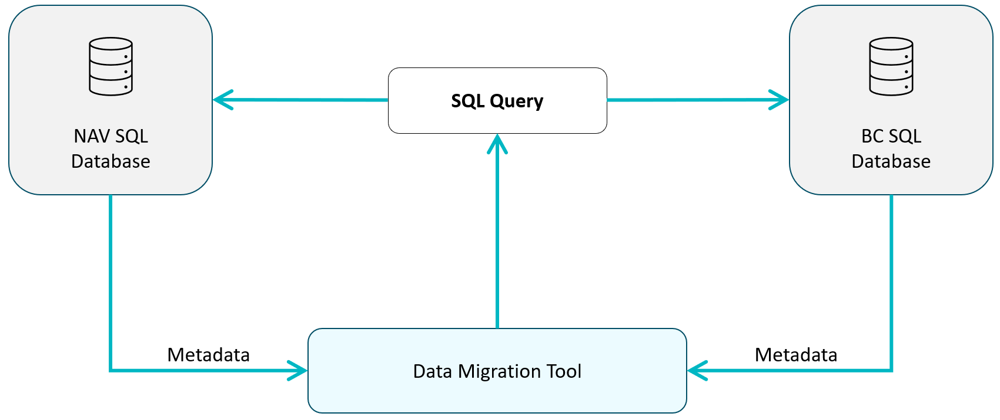

# Data Migration Tool

Aplikacja Data Migration Tool służy do szybkiej migracji danych pomiędzy Dynamics NAV od wersji 2009 do Business Central. Migracja wykonywana jest w jednym kroku z wykorzystaniem automatycznie wygenerowanych zapytań SQL wykonywanych bezpośrednio na serwerze źródłowym lub docelowym.
​Główne zalety z zastosowania aplikacji Migration Tool to:

1. Pełna migracja danych​
2. Możliwość uruchomienia wersji produkcyjnej BC w dowolnym momencie.​
3. Migracja danych Dynamics NAV od wersji 2009 do Business Central w jednym kroku​
4. Migracja danych aplikacji standardowej oraz modułów dodanych (np. Polish Localization)​
5. Szybka migracja dużych ilości danych.​
6. Wspomaganie w mapowaniu danych.​
7. Kontrola poprawności mapowania.​
8. Możliwość eksportu oraz importu mapowania.

> [!CAUTION]
> Użycie aplikacji Data Migration Tool jest możliwe jedynie wtedy, gdy **po stronie źródła nie są wykorzystywane aplikacje zawierające Table Extensions**.

> [!CAUTION]
> Użycie aplikacji Data Migration Tool jest możliwe jedynie wtedy, gdy **po stronie celu nie jest wykorzystywane środowisko multitenant**.

Schemat działania:

Data Migration Tool można wykorzystać również w przypadku kiedy baza docelowa i źródłowa znajdują się na jednym serwerze.

Aplikacja Data Migration Tool może być zainstalowana na dowolnej instancji Business Central od wersji 22.3. Warunkiem jest, aby środowisko, na którym działa instancja (np kontener) miało dostęp do migrowanych serwerów SQL (źródłowego i docelowego). Dostęp może być realizowany poprzez sieć VPN, prędkość transmisji danych pomiędzy środowiskiem, na którym działa aplikacja a serwerami SQL nie wpływa w zauważalny sposób na proces migracji.

> [!TIP]
> Po zainstalowaniu aplikacji w celu ułatwienia pracy, sugerujemy ustawienie roli użytkownika na **Data Migration Specialist**.

# Kroki migracji danych

Poniżej przedstawiono kroki, które należy wykonać, aby przeprowadzić migrację danych z wykorzystaniem aplikacji Data Migration Tool:

1. Zdefiniować bazy danych biorących w migracji
2. Pobrać metadane
3. Zweryfikować poprawność pobranych metadanych
4. Utworzyć zestaw danych migracji
5. Zapisywanie i używanie zapisanych mapowań
6. Zwolnić zestaw danych migracji
7. Stworzyć rekord migracji
8. Wygenerować zapytania SQL
9. Uruchomić zapytania SQL

Poszczególne kroki zostaną szczegółowo omówione poniżej 

# Ustawienia Baz Danych

Pierwszym krokiem w procesie migracji danych jest ustawienie danych dostępowych do baz SQL źródłowej (NAV) i docelowej (BC).

## Ustawienia

Aby wprowadzić lub zmodyfikować ustawienia baz danych:

1. Wybierz ikonę , wprowadź **SQL Databases**, a następnie kliknij powiązane łącze.
2. Na stronie SQL Databases uzupełnij pola:
   - **Code** - określa kod bazy danych.
   - **Server Name** - nazwa serwera (lub adres IP) na którym znajduje się definiowana baza danych.
   - **Database Name** - nazwa bazy danych.
   - **User Name** - nazwa użytkownika bazy danych.
   - **Password** -  hasło do konta użytkownika bazy danych.
   - **Use Metadata Set Code** - kod metadanych - pole wykorzystywane w przypadku migracji z wersji starszych niż NAV 2013R2. Więcej informacji zamieszczono w rozdziale **Pobranie metadanych** 
   - **Forbidden Chars** - pole uzupełniane automatycznie - określa niedozwolone znaki w nazwach tabel SQL.
   - **Application Version** - pole uzupełniane automatycznie określa wersję aplikacji NAV lub BC.

    > [!CAUTION]
    > Wybrany do migracji użytkownik bazy danych musi posiadać uprawnienia pozwalające na odczytywanie i modyfikację wszystkich danych w bazie.

    > [!CAUTION]
    > Na stronie SQL Databases Należy utworzyć dwa osobne rekordy dla bazy SQL źródłowej i docelowej.

# Pobieranie Metadanych

Struktura obiektów aplikacji NAV orac BC zapisywana jest w postaci metadanych przechowywanych w bazie danych SQL. Aplikacja Data Migration Tool wykorzystuje metadane aby:

1. Utworzyć niezbędne struktury umożliwiające łatwe ustawienie mapowania tabel oraz pól.
2. Umożliwić weryfikację poprawności mapowania.
3. Wygenerować zapytania SQL, które są odpowiedzialne bezpośrednio za proces migracji.

## Pobieranie metadanych dla Dynamics NAV 2013 R2 oraz późniejszych

Aby pobrać metadane z bazy, które obsługują wersje systemu wyższe od NAV 2013R2:

1. Wybierz ikonę , wprowadź **SQL Databases**, a następnie kliknij powiązane łącze.
2. Na stronie SQL Databases wybierz bazę dla której chcesz pobrać metadane.
3. Z zakładki **Actions** wybierz akcję **Get Metadata**.
4. Jeżeli ustawienia bazy danych były poprawnie zdefiniowane proces pobierania metadanych rozpocznie się automatycznie.

Proces pobierania metadanych jest dość złożony i może trwać od kilkunastu do nawet kilkudziesięciu minut (w zależności od stopnia złożoności modyfikacji).
Jeżeli proces zakończy się sukcesem, pole Metadata Exists będzie zaznaczone automatycznie.

## Pobieranie metadanych dla wersji od Dynamics NAV 2009 do 2013 R2

Dla wersji wcześniejszych niż Dynamics NAV 2013 R2 Microsoft stosował nieudokumentowany sposób kompresji danych w polach typu BLOB, co uniemozliwia bezpośrednie pobranie metadanych. Aby umożliwić pobranie metadanych w tym przypadku należy:

1. Pobrać codeunit umożliwiający eksport danych z wcześniejszych wersji systemu

    * Wybierz ikonę , wprowadź **Application Metadata Set List**, a następnie kliknij powiązane łącze.
    * Na stronie Application Metadata Set List uruchom akcję **Get Export CU for NAV 2009**.
    
2. Dostosować pobrany Codeunit 90010 Export Objects Metadata do posiadanej wersji systemu Dynamics NAV, zaimportować oraz skompilować. Codeunit pozwala na eksport metadanych do pliku w formacie umożliwiającym wczytanie do aplikacji Data Migration Tool.

3. Uruchomić zaimportowany codeunit Export Objects Metadata oraz zapisać plik wynikowy zawierający metadane.

4. Wczytać plik metadanych do aplikacji Data Migration Tool

    * Wybierz ikonę , wprowadź **Application Metadata Set List**, a następnie kliknij powiązane łącze.
    * Na stronie Application Metadata Set List utwórz nowy rekord, uzupełnij pola:
        * Code - kod metadanych
        * Description - opis metadanych
    * Uruchom akcję **Import Metadata Set**.
    * Wybierz plik wyeksportowany w kroku 3 i zaimportuj.

5. Następnie aby pobrać wczytane metadane do struktury aplikacji Data Migration Tool:

    * Wybierz ikonę , wprowadź **SQL Databases**, a następnie kliknij powiązane łącze.
    * Na stronie Application Metadata Set List wybierz bazę dla której chcesz pobrać metadane.
    * Rozwiń listę w polu **Use Metadata Set Code** i wybierz kod metadanych utworzony w kroku 4.
    * Wybierz akcję **Get Metadata** aby zaimportować dane.

# Zestaw danych migracji

Zestaw danych migracji reprezentuje zbór danych, które będą migrowane z bazy źródłowej do docelowej. Zestaw zawiera listę tabel źródłowych i docelowych oraz definicję pól źródłowych i docelowych. Utworzenie poprawnego zestawu danych migracji jest kluczowe dla zapewnienia poprawności procesu migracji.

## Tworzenie zestawu danych migracji

Aby utworzyć lub zmodyfikować zestaw danych migracji:

1. Wybierz ikonę , wprowadź **Migration Datasets**, a następnie kliknij powiązane łącze.
2. Na stronie Migration Datasets utwórz nowy zestaw danych migracji lub zmodyfikuj istniejący.
3. Wprowadź odpowiednie wartości w sekcji **General** oraz **Migration Dataset Tables**

Poniżej znajduje się szczegółowy opis poszczególnych sekcji kartoteki **Migration Dataset Card**

Sekcja **General** zawiera następujące pola:

- **Code** - określa kod zestawu danych migracji
- **Source SQL Database Code** - określa kod źródłowej bazy danych (Dynamics NAV).
- **Target SQL Database Code** - określa kod docelowej bazy danych (Business Central).
- **Description/Notes** - określa dowolny opis zestawu danych migracji.
- **Released** - określa czy zestaw danych migracji został zwolniony i może być użyty w dalszym etapie procesu migracji.

Sekcja **Migration Dataset Tables** zawiera szczegółowe ustawienia dotyczące migrowanych tabel oraz pól. 

- **Source Table Name** - określa nazwę tabeli źródłowej
- **Target Table Name** - określa nazwę tabeli docelowej
- **Description/Notes** - określa dowolny opis umożliwiający dodanie komentarza przez użytkownika uzupełniającego dane.
- **Skip In Mapping** - określa, czy dana tabela będzie pominięta w procesie migracji
- **Number Of Errors** - określa ilość błędów walidacji poprawności mapowania
- **Number of Warnings** - określa ilość ostrzeżeń walidacji poprawności mapowania.

### Uzupełnienie tabel zestawu migracji

Tabele zestawu danych migracji można uzupełnić automatycznie lub manualnie.

#### Manualne uzupełnienie tabel zestawu migracji danych

Aby uzupełnić manualnie listę tabel podlegających migracji w wybranym zestawie danych migracji w sekcji **Migration Dataset Tables** kartoteki **Migration Dataset Card**:

1. Korzystając z przycisku asysty w polu **Source Table Name** wybierz nazwę tabeli źródłowej.
2. Korzystając z przycisku asysty w polu **Target Table Name** wybierz nazwę tabeli docelowej.

#### Automatyczne wstawianie uzupełnianie tabel zestawu migracji danych

Aby uzupełnić automatycznie listę tabel podlegających migracji w wybranym zestawie danych migracji w sekcji **Migration Dataset Tables** kartoteki **Migration Dataset Card**:

1. Na stronie **Migration Dataset Card** wybranego zestawu danych użyj akcji **Insert Tables**.
2. Ustaw parametry:
    - **Insert option** - określa, które tabele zostaną wstawione. Możliwe są następujące opcje: 
        * All Tables - system uzupełni wszystkie tabele źródłowe, a następnie dopasuje tabele docelowe. 
        * Tables contains data - system uzupełni tabele źródłowe, które zawierają dane (ale tylko te, które mają ustawiony parametr Data Per Company = Yes), a nastepnie dopasuje tabele docelowe.
        * Common tables contains data - system uzupełni tabele źródłowe, które zawierają dane (ale tylko te, które mają ustawiony parametr Data Per Company = No), a nastepnie dopasuje tabele docelowe.
    - **All companies** - jeżeli w poprzednim wyborze wybrano Tables contains data, pole określa, czy system ma wstawić tabele zawierające dane w którejkolwiek firmie.
    - **Selected Company** - jeżeli w poprzednim wyborze nie zaznaczono All companies, należy określić, której firmy źródłowej system ma użyć w celu określenia, czy tabela zawiera dane. 
3. Kliknij przycisk OK, aby rozpocząć automatyczne uzupełnienie tabel zestawu danych migracji.

### Mapowanie pól tabel zestawu migracji danych

Każda tabela zestawu migracji danych zawiera szczegółowe ustawienia dotyczące pola źródłowego oraz docelowego. W trakcie dodawania tabel do listy w sekcji **Migration Dataset Tables** system automatycznie uzupełnia pola źródłowe oraz docelowe dla danej tabeli. W przypadku, gdy wszystkie pola tabeli źródłowej oraz docelowej posiadają te same nazwy oraz typy danych system automatycznie dokona odpowiednich ustawień. Jednak w sytuacji, gdy nazwy pól się różnią, należy dokonać manualnego dopasowania.
Aby sprawdzić listę pól:

1. W sekcji **Migration Dataset Tables** wybierz wiersz zawierający uzupełnioną tabelę źródłową oraz docelową.
2. Użyj akcji **Fields** aby przejść do strony **Migration Dataset Table Fields** zawierającej listę pól źródłowych i docelowych danej tabeli.
3. Uzupełnij lub zmodyfikuj wartości pól.

- **Mapping Type** - określa typ mapowania. Możliwe są następujące wartości:
    * Field to Field: wartość pola źródłowego zostanie przypisana do pola docelowego 
    * Constant to field: umożliwia przypisanie dowolnej stałej wartości do pola docelowego np w sytuacji, gdy w tabeli docelowej zostało dodane nowe pole, do którego chcemy przypisać stałą wartość.
- **Source Field Name** - określa nazwę pola źródłowego z tabeli źródłowej. Przycisk asysty pozwala wybrać nazwę pola z listy.
- **Target Field Name** - określa nazwę pola docelowego w tabeli docelowej. Przycisk asysty pozwala wybrać nazwę pola z listy.
- **No. of Target Field Proposals** - pole wyliczane automatycznie, określa ilość propozycji nazwy pola docelowego. W przypadku, gdy w tabeli docelowej nie istnieje pole o takiej samej nazwie, system próbuje odnaleźć nazwę pola docelowego na podstawie fragmentu nazwy źródłowej. Przykładowo gdy do tabeli źródłowej w procesie modyfikacji zostało dodane pole "Descirption 3", prawdopodobnie w tabeli docelowej dodano rozszerzenie tabeli, gdzie pole nazywa się "ITI Description 3" (dodany przedrostek rozszerzenia). W takim przypadku system automatycznie nie dopasuje pola docelowego (wartość będzie pusta) jednak wartość **No. of Target Field Proposals** nie będzie zerowa. Wystarczy kliknąć w niezerową wartość pola **No. of Target Field Proposals** i wybrać pole z listy propozycji. 
- **Is Empty** - określa, czy w bazie źródłowej wartość pola źródłowego jest uzupełniona w którymkolwiek rekordzie. Informacja ta pomaga podjąć decyzję o migracji danego pola źródłowego w przypadku, gdy trudno jest określić pole docelowe, lub gdy pole tabeli zostało usunięte w bazie docelowej. Ze względu na wydajność aplikacji wartości w polu **Is Empty** nie są obliczane automatycznie. Użyj akcji **Get Empty Fields Count** aby obliczyć wartości. Po obliczeniu wartości kliknięcie na wartość pola Is Empty pozwala zobaczyć ilość pustych i uzupełnionych rekordów, co może być pomocne w podjęciu decyzji, gdy pole nie jest puste, ale jest uzupełnione np w kilku rekordach na kilka tysięcy.
- **Number of Errors** - określa ilość błędów walidacji w danym mapowaniu.
- **Number of Warnings** - określa ilość ostrzeżeń walidacji w danym mapowaniu.
- **Comments** - pozwala na dodanie dowolnego komentarza do danego mapowania.
- **Ignore Errors** - określa, czy błędy i ostrzeżenia będą ignorowane w danym polu. Zaznaczenie pola umożliwia świadome zignorowanie błędu lub ostrzeżenia.
- **Skip in Mapping** - określa, czy dane pole ma zostac pominięte w procesie migracji.

#### Uzupełnienie mapowania opcji pól tabel migracji danych

Pola zawierające typ danych typu Option wymagają mapowania opcji źródłowych na docelowe. Wszystkie opcje źródłowe muszą być zmapowane na opcje docelowe. W przypadku, gdy nazwy opcji pola tabeli źródłowej i docelowej są takie same, system automatycznie dokonuje mapowania. Jednak w przypadku różnic, mapowanie musi zostać wykonane manualnie.
Aby wyświetlić ustawienia mapowania opcji pola tabeli, na stronie **Migration Dataset Table FIelds**, wybierz pole zawierające typ danych Option a następnie użyj akcji **Options Mapping**.

Akcja uruchamia stronę **Migration Dataset Table Field Options** zawierającą ustawienia mapowania opcji:

- **Source Option ID** - określa identyfikator opcji pola źródłowego. Przycisk asysty pozwala wybrać identyfikator opcji z listy.
- **Source Option Name** - określa nazwę opcji pola źródłowego. Wartość jest uzupełniana automatycznie na podstawie identyfikatora.
- **Target Option ID** - określa identyfikator opcji pola docelowego. Przycisk asysty pozwala wybrać identyfikator opcji z listy.
- **Target Option Name** - określa nazwę opcji pola docelowego. . Wartość jest uzupełniana automatycznie na podstawie identyfikatora.

#### Dodatkowe pola docelowe

Jedno pole tabeli źródłowej domyślnie jest mapowane na jedno pole tabeli docelowej. Jednak w specyficznych przypadkach może istnieć potrzeba przeniesienia wartości pola tabeli źródłowej do wielu pól tabeli docelowej. W takim przypadku:

1. Na stronie **Migration Dataset Table Fields** wybierz akcję **Additional Target Fields**
2. Korzystając z przycisku asysty wybierz pola docelowe, do które chcesz zmapować.

# Zapisywanie i używanie zapisanych mapowań

Aplikacja Data Migration Tool umożliwia tworzenie, eksport oraz import przygotowanych mapowań. Funkcjonalność można wykorzystać w celu przyspieszenia tworzenia ustawień zestawu migracji danych poprzez nałożenie na przygotowane tabele oraz pola typowego mapowania specyficznego dla wspólnej w wielu organizacjach aplikacji.

## Tworzenie mappingu

Nowy mapping można utworzyć na kilka sposobów.

### Manualne tworzenie mappingu

Mapping można utworzyć całkowicie manualnie. 

1. Wybierz ikonę , wprowadź **Mappings**, a następnie kliknij powiązane łącze.
2. Na stronie Mappings utwórz nowy mapping, uzupełnij pola:

- **Code** - określa kod mappingu.
- **Opis** - określa opis mappingu.

3. Wybierz akcję **Tables** aby zdefiniować tabele źródłowe oraz docelowe. Uzupełnij pola:

- **Source Table Name** - nazwa tabeli źródłowej.
- **Target Table Name** - nazwa tabeli docelowej.

4. Jeżeli chcesz zdefiniować również mapowanie pól, wybierz akcję **Fields** oraz uzupełnij pola:

- **Source Field Name** - nazwa pola źródłowego tabeli źródłowej.
- **Target Field Name** - nazwa pola docelowego tabeli docelowej.

5. Dla pól o typie Opcja, wybierz akcję **Field Options** oraz uzupełnij pola:

- **Source Field Option** - identyfikator opcji źródłowej.
- **Target Field Option** - identyfikator opcji docelowej.

### Tworzenie mappingu z zestawu danych migracji

Zestaw danych migracji może być zapisany jako mapping oraz użyty w innym projekcie lub np np podczas migracji produkcyjnej na innym środowisku.

1. Wybierz ikonę , wprowadź **Migration Datasets**, a następnie kliknij powiązane łącze.
2. Na stronie Migration Datasets wybierz zestaw danych migracji dla którego chcesz zapisać mapping i wybierz akcję Edit
3. Na stronie Migraton Dataset Card wybierz akcję Mapping/Create Mapping from Dataset.
4. Wprowadź Kod oraz Opis dla nowego mappingu i wybierz przycisk OK.

System automatycznie utworzy mapping na podstawie zestawu migracji danych.

### Eksportowanie i importowanie mappingu z pliku

Utworzony mapping można wyeksportować do pliku, a następnie importować w innym projekcie lub np podczas migracji produkcyjnej.

#### Eksportowanie

1. Wybierz ikonę , wprowadź **Mappings**, a następnie kliknij powiązane łącze.
2. Na stronie Mappings wybierz mapping, który chcesz wyeksportować do pliku.
3. Następnie wybierz akcję Export Mapping.

Plik mappingu zostanie zapisany w domyślnej lokalizacji dla pobranych plików przeglądarki internetowej.

#### Importowanie

1. Wybierz ikonę , wprowadź **Mappings**, a następnie kliknij powiązane łącze.
2. Na stronie Mappings utwórz nowy mapping, uzupełnij pola:

- **Code** - określa kod mappingu.
- **Opis** - określa opis mappingu.

3. Następnie wybierz akcję Import Mapping.
4. Wybierz plik zawierający wyeksportowany mapping.

Plik mappingu zostanie wczytany do nowo utworzonego mappingu.

## Używanie mappingu

Wykorzystanie mappingu możliwe jest na dwa sposoby. 

### Wstawianie tabel oraz ustawień mapowania pól do zestawu migracji danych.

Aby wstawić tabele oraz ustawienia mapowania pól do nowego zestawu migracji danych:

1. Wybierz ikonę , wprowadź **Migration Datasets**, a następnie kliknij powiązane łącze.
2. Na stronie Migration Datasets wybierz zestaw danych migracji do którego chcesz wstawić mapping i wybierz akcję Edit
3. Na stronie Migraton Dataset Card wybierz akcję Mapping/Insert Mapping.
4. Wybierz kod mappingu, który chcesz wstawić do wybranego zestawu migracji danych.
5. Wybierz przycisk OK.

Tabele oraz ustawienia mapowania pól zawarte w wybranym mappingu zostaną wstawione do wybranego zestawu migracji danych.

### Uzupełnianie ustawień mapowania w istniejącym zestawie migracji danych

Zapisany mapping może określać ustawienia mapowania dla wybranej funkcjonalności lub aplikacji (np polska funkcjoalność lub funkcjonalność Kadry płace)
Aby zautomatyzować proces mapowania abel oraz pól, na istniejące ustawienia zestawu migracji danych może zostać "nałożony" wybrany mapping. 
W tym przypadku zostaną automatycznie uzupełnione ustawienia mapowania pól tabel w istniejącym zestawie danych migracji bez dodawania nowych tabel.

Aby uzupełnić istniejące ustawienia mapowania w zestawie migracji:

1. Wybierz ikonę , wprowadź **Migration Datasets**, a następnie kliknij powiązane łącze.
2. Na stronie Migration Datasets wybierz zestaw danych migracji dla którego chcesz zastosować zapisany mapping i wybierz akcję Edit
3. Na stronie Migraton Dataset Card wybierz akcję Mapping/Update Mapping.
4. Wybierz kod mappingu, który chcesz zastosować do wybranego zestawu migracji danych.
5. Wybierz przycisk OK.

# Zwolnienie zestawu danych migracji

Przed wykorzystaniem ustawień zawartych w zestawie danych migracji do wygenerowania zapytań SQL, utworzony zestaw migracji należy zwolnić. W trakcie tego procesu system automatycznie weryfikuje poprawność ustawień zestawu danych migracji. Zwolnienie nie jest możliwe, jeżeli zestaw danych migracji zawiera błędy.

Aby zwolnić utworzony zestaw danych migracji:

1. Wybierz ikonę , wprowadź **Migration Datasets**, a następnie kliknij powiązane łącze.
2. Na stronie Migration Datasets wybierz zestaw danych migracji który chcesz zwolnić i wybierz akcję Edit
3. Na stronie Migraton Dataset Card wybierz akcję Release.
4. Jeżeli zestaw danych migracji nie zawiera błędów, pole Released zostanie zaznaczone.

W przypadku, gdy zestaw danych migracji zawiera błędy, należy rozwiązać wszystkie komunikaty błędów i ponownie spróbować zwolnić zestaw danych migracji.
Ilość błędów oraz rozszerzeń widoczny jest w sekcji **Errors & Warnings** w polach:

- **Number of Errors** - określa sumaryczną ilość błędów w zestawie danych migracji.
- **Number of Warnings** - określa sumaryczną ilość ostrzeżeń w zestawie danych migracji.
- **Number of Skipped Errors** - określa sumaryczną ilość błędów w zestawie danych migracji, dla których zaznaczono pole "Skip Errors" ustawieniach mapowania.
- **Number of Skipped Warnings** - określa sumaryczną ilość ostrzeżeń w zestawie danych migracji, dla których zaznaczono pole "Skip Errors" ustawieniach mapowania.

Aby przejść do listy błędów lub ostrzeżeń należy kliknąć na liczbę reprezentującą daną wartość.

Pola **Number of Errors** oraz **Number of Warnings** znajdują się również w sekcji **Migration Dataset Tables** oraz w ustawieniach pól oraz opcji pól.

# Tworzenie migracji

Aplikacja Data Migration Tool umożliwia utworzenie ustawień umożliwiających uruchomienie migracji niezależnie dla każdej firmy źródłowej i docelowej.

Aby utworzyć nową migrację:

1. Wybierz ikonę , wprowadź **Migrations**, a następnie kliknij powiązane łącze.
2. Na stronie Migrations utwórz nową migrację lub zmodyfikuj istniejącą.
3. Uzupełnij pola:

    * **Code** - określa kod migracji.
    * **Executed** - określa, czy migracja została uruchomiona. Pole jes automatycznie uzupełniane przez system.
    * **Generated Queries** - określa, czy dla danej migracji zostały wygenerowane zapytania SQL.
    * **Migration Dataset Code** - określa, który zestaw danych migracji ma być zastosowany do wygenerowania zapytań SQL.
    * **Source SQL Database COde** - określa kod źródłowej bazy danych SQL. Pole jest automatycznie uzupełniane na podstawie kodu zestawu danych migracji.
    * **Source Company Name** - Określa nazwę firmy źródłowej, z której będą pobrane dane.
    * **Target SQL Database Code** - określa kod docelowej bazy danych SQL. Pole jest automatycznie uzupełniane na podstawie kodu zestawu danych migracji.
    * **Target Company Name** - Określa nazwę firmy źródłowej, do której będą wstawione dane.
    * **Execute On** - określa na którym serwerze będą uruchomione zapytania SQL. Możliwe są do wyboru dwie opcje: Target - zapytania będą uruchamiane na serwerze docelowym, Source - zapytania będą uruchamiane na serwerze źródłowym. DOmyślnym wyborem jest opcja Target.
    * **Do Not Use Transaction** - Określa, czy zapytania mają być wykonywane w transakcjach. W przypadku, gdy serwery SQL nie obsługują transakcji rozproszonych, pole należy zaznaczyć.

# Generowanie i administracja zapytaniami SQL

Przed uruchomieniem procesu migracji należy wygenerować zapytania SQL.

1. Wybierz ikonę , wprowadź **Migrations**, a następnie kliknij powiązane łącze.
2. Na stronie Migrations wybierz migrację, dla której chcesz wygenerować zapytania SQL.
3. Wybierz akcję **Generate Queries** aby wygenerować zapytania SQL.

System rozpocznie generowanie zapytań SQL. Jeżeli proces zakończy się powodzeniem, pole **Generated Queries** zostanie zaznaczone automatycznie.

## Wygenerowane zapytania SQL

Aby sprawdzić jakie zapytania SQL zostały wygenerowane:

1. Wybierz ikonę , wprowadź **Migrations**, a następnie kliknij powiązane łącze.
2. Na stronie Migrations wybierz migrację, dla której pole **Generated Queries** jest zaznaczone.
3. Wybierz akcję **Related/Queries**
4. Strona **Migration SQL Queries zawiera nieedytowalne pola:

    * **Query No** - zawiera numer wygenerowanego zapytania SQL dla danej migracji.
    * **Description** - zawiera automatycznie wygenerowany opis zapytania Nazwa tabeli źródłowej -> Nazwa tabeli docelowej.
    * **Executed** - określa, czy zapytanie zostało uruchomione.
    * **Modified** - określa, czy zapytanie zostało zmodyfikowane manualnie.
    * **Running In Bacground Session** - określa, czy zapytanie jest aktualnie uruchomione w sesji zdalnej.

## Podgląd wygenerowanych zapytań SQL

Aplikacja Data Migration Tool generuje dwa rodzaje zapytań SQL.
- Zapytanie SQL linkujące serwery.
- Zapytania odpowiadające za transfer danych.
W momencie uruchomienia migracji najpierw wykonywane jest zapytanie linkujące serwery, a następnie jedno lub więcej zapytań odpowiadających za transfer danych.

### Zapytanie SQL linkujące serwery.

Aby edytować lub podejrzeć zapytanie SQL linkujące serwery:

1. Wybierz ikonę , wprowadź **Migrations**, a następnie kliknij powiązane łącze.
2. Na stronie Migrations wybierz migrację, dla której pole **Generated Queries** jest zaznaczone.
3. Wybierz akcję **Related/Edit Linked Server Query** aby przejść do podglądu i edycji zapytania 

Strona Edit Linked Server Query pozwala na wprowadzenie modyfikacji wyświetlonego zapytania.
Aby zapisać wprowadzone zmiany użyj akcji **Save**.

### Zapytania odpowiadające za transfer danych.

Aby edytować lub podejrzeć zapytanie SQL odpowiadające za transfer danych:

1. Wybierz ikonę , wprowadź **Migrations**, a następnie kliknij powiązane łącze.
2. Na stronie Migrations wybierz migrację, dla której pole **Generated Queries** jest zaznaczone.
3. Wybierz akcję **Related/Queries**.
4. Wybierz zapytanie, które chcesz podejrzeć lub edytować.
5. Wybierz akcję **Edit Query Text** aby przejść do podglądu i edycji zapytania.

Strona Edit SQL Query pozwala na wprowadzenie modyfikacji wyświetlonego zapytania.
Aby zapisać wprowadzone zmiany użyj akcji **Save**.

## Pobieranie wygenerowanych zapytań SQL.

Aplikacja Data Migration Tool pozwala na uruchomienie wygenerowanych zapytań SQL. Jednak z różnych względów może zaistnieć potrzeba pobrania zapytań w pliku tekstowym.

### Pobieranie zapytań SQL.

1. Wybierz ikonę , wprowadź **Migrations**, a następnie kliknij powiązane łącze.
2. Na stronie Migrations wybierz migrację, dla której pole **Generated Queries** jest zaznaczone.
3. Wybierz akcję **Related/Queries**.
4. Zaznacz jedno lub więcej zapytań, które chcesz pobrać.
5. Wybierz akcję **Download Query Text** aby pobrać treść zapytań do pliku tekstowego.

> [!CAUTION]
> Pobrane zapytania odpowiadające za transfer danych zawiera doklejoną treść zapytania linkującego serwery na początku pliku.

# Uruchomienie i monitorowaie migracji

Aplikacja Data Migration Tool umożliwia uruchomienie oraz monitoring wykonywania wygenerowanych zapytań SQL.

> [!CAUTION]
> Uruchomienie migracji usuwa wszystkie istniejące dane z migrowanych tabel w bazie docelowej.

## Uruchomienie migracji danych

Aby uruchomić sekwencyjnie wszystkie wygenerowane zapytania dla wybranej migracji:

1. Wybierz ikonę , wprowadź **Migrations**, a następnie kliknij powiązane łącze.
2. Na stronie Migrations wybierz migrację, którą chcesz uruchomić, dla której pole **Generated Queries** jest zaznaczone.
3. Wybierz akcję **Execute In Background**
4. System rozpocznie sekwencyjne uruchamianie zapytań w sesji w tle.

## Uruchomienie pojedynczego zapytania

Aby uruchomić pojedyncze wygenerowane zapytanie dla wybranej migracji:

1. Wybierz ikonę , wprowadź **Migrations**, a następnie kliknij powiązane łącze.
2. Na stronie Migrations wybierz migrację, której zapytanie chcesz uruchomić, dla której pole **Generated Queries** jest zaznaczone.
4. Wybierz akcję **Related/Queries** aby przejść do listy wygenerowanych zapytań SQL.
5. Na stronie **Migration SQL Queries** Wybierz zapytanie, które chcesz uruchomić 
5. Wybierz akcję **Execute In Background**
4. System uruchomi zapytanie w sesji w tle.

## Monitorowanie sesji działających w tle uruchamiających zapytania SQL.

Aby monitorować status sesji działających w tle.

1. Wybierz ikonę , wprowadź **Migrations**, a następnie kliknij powiązane łącze.
2. Na stronie Migrations wybierz migrację, którą chcesz monitorować.
3. Wybierz akcję **Related/Migration Background Sessions**
4. Strona **Migr. Background Sessions** zawiera następujące pola:

    - **Migration Code** - Określa kod migracji danych.
    - **Query No** - Określa nr zapytania SQL
    - **Session Unique ID** - Określa unikalny identyfikator sesji
    - **Is Active** - określa, czy sesja jest aktywna
    - **No Of Session Events** - określa ilość zdarzeń (błędów) sesji
    - **Last Comment** - określa ostatni komunikat błedu sesji. "Session event not found" oznacza, że sesja zakończyła się poprawnie.

## Log wykonanych zapytań SQL.

Aby monitorować status wykonanych zapytań.

1. Wybierz ikonę , wprowadź **Migrations**, a następnie kliknij powiązane łącze.
2. Na stronie Migrations wybierz migrację, którą chcesz monitorować.
3. Wybierz akcję **Related/Log Entries**
4. Strona **Migration Log Entries** zawiera następujące pola:

    - **Entry No** - Określa nr kolejny zapisu.
    - **Error Description** - Określa opis błedu, który wystąpił w trakcie wykonywania zapytania.
    - **Executed by User ID** - Określa identyfikator użytkownika, który uruchomił zapytanie.
    - **Starting Date Time** - Określa datę i godzinę uruchomienia zapytania.
    - **Ending Date Time** - Określa datę i godzinę zakończenia wykonywania zapytania.
    - **Migration Code** - Określa kod migracji danych.
    - **Query No** - Określa nr zapytania SQL.
    - **Query Description** - Określa opis zapytania SQL (Nazwa tabeli źródłowej -> nazwa tabeli docelowej)

